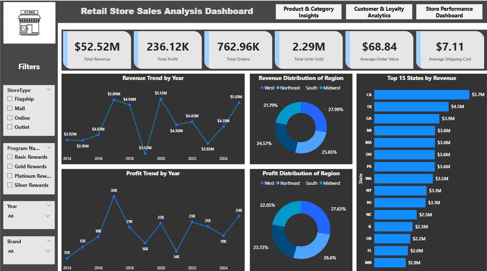
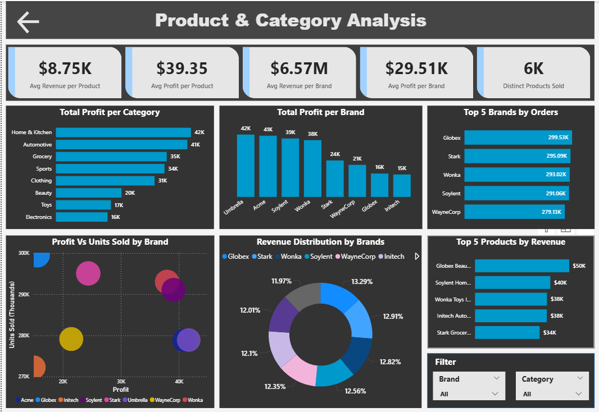

# Retail Store Data Warehouse & Analytics Project

A complete end-to-end **Data Warehouse** and **Analytics** project for an offline retail store chain.  
The project builds a **SQL Server Data Warehouse** using raw sales CSVs and delivers **Business Insights**, **KPIs**, and a **Power BI Dashboard** for data-driven decision-making.

---

## Project Overview

This project simulates a real-world retail business environment where transactional data from multiple years is transformed into a **Snowflake Schema** for BI consumption.

✔ Extract → Transform → Load using Python  
✔ Cleans and combines **12 years of CSV Data** (2014–2025 YTD)  
✔ **Snowflake Modeling** with historical trend analysis  
✔ Efficient indexing for fast reporting performance  
✔ Power BI dashboard for deep analytics & visual insights  

---

## Tech Stack

| Layer | Tools |
|------|------|
| **Data Storage** | SQL Server |
| **ETL Development** | Python (Pandas, PyODBC) |
| **Data Modeling** | Snowflake Schema |
| **Orchestration** | Manual (CLI Trigger) |
| **Visualization** | Power BI |
| **Version Control** | GitHub |

---


## Project Structure:
       Retail-Store-Data-Warehouse-Analytics-Project/
       │── data/ # Raw CSV Data Files (2014–2025 YTD)
       │── sql/ # SQL scripts for schema, dims & fact loading
       │── .env
       │── powerbi/ # PBIX Dashboard
       │── docs/ # ER Diagram & Data Model architecture
       │── requirements.txt
       │── etl.py 
---

## Data Warehouse Schema – Snowflake Model

### Fact Table
- `FactSales` — Retail transactions (Revenue & Quantity metrics)

### Dimension Tables
- `DimCustomer` → Linked to `DimLoyaltyProgram`
- `DimProduct`
- `DimStore`
- `DimDate`
- `DimLoyaltyProgram` *(Snowflake extension)*

📌 Reason for Snowflake Modeling:  
**Loyalty program attributes are normalized into a separate dimension** to avoid redundancy and maintain history.

---

##  Data Model 


---
## 📊 Business KPIs & Insights
This warehouse answers key business questions:

| Business Question | Insight Type |
|------------------|--------------|
| Which stores generate the highest revenue? | Store performance |
| Which loyalty tiers bring highest repeat sales? | Customer segmentation |
| What product categories drive profit? | Merchandising |
| Do discounts improve or hurt revenue? | Promotion analytics |
| Which Years perform better? | Trend forecasting |
| Weekday vs Weekend sales difference? | Operational planning |

---

## 📈 Power BI Dashboard — Key Highlights

✔ Total Revenue • Total Orders • AOV  
✔ Regional store performance  
✔ Category & brand contribution  
✔ YoY / MoM trend analytics  
✔ Loyalty Tier Revenue distribution  
✔ Shipping cost impact on margin  

📌 File: `powerbi/Retail_Sales_Analytics.pbix`
### Home Page


### Product and Cateogry Page


**Currently doing** Customer and Store Analysis
---

## 🔄 ETL Pipeline (Python → SQL Server)

The ETL script:

- Validates and maps CSV columns
- Standardizes date formats
- Auto-fixes loyalty column naming issues
- Loads staging → dimensions → fact tables
- Handles batch insert performance optimizations
- Adds lineage tracking (SourceFile)

### ▶️ Run ETL

```bash
python etl/load_warehouse.py
